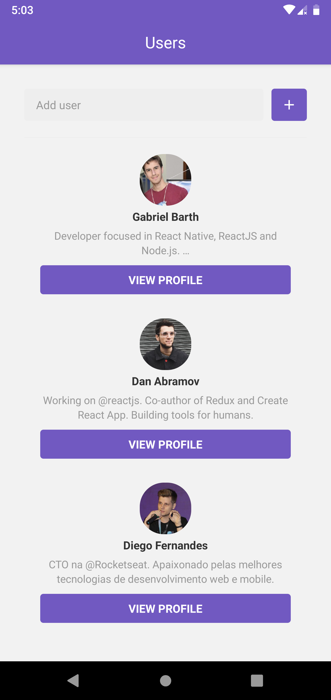
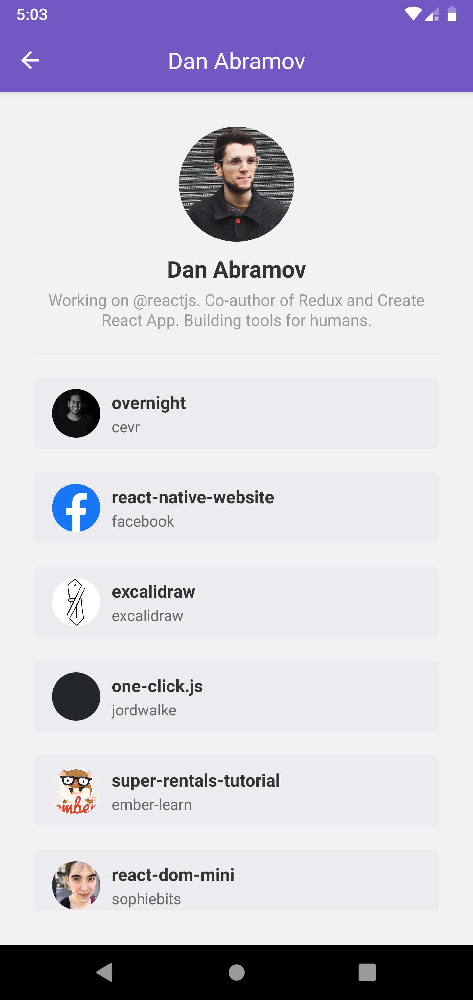
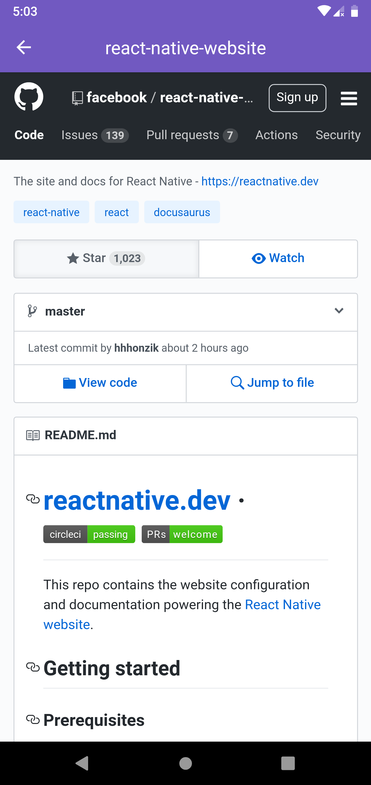

<h1 align="center">
   
  <br>
  Github Users mobile application
</h1>

<h3 align="center">
:computer: Web version <a href="https://github.com/gabrielbarth/git-repos-web">here</a>
</h3>


:us: 
<br>
Mobile application to include github users that allows view its starred repositories and view these repositories thought webview. Developed during GoStack10 bootcamp sixth challenge.
<br>
<span>&#x1f1e7;&#x1f1f7;</span>
<br>
Aplicativo mobile que permite o cadastro de usuários do github, a listagem dos repositórios favoritados e a vizualização destes repositórios através de webview. Desenvolvido durante o desafio 06 do bootcamp GoStack10.


##  :mag_right: Main points covered on project / Principais pontos
:us: 
- It was consumed GitHub API;
- FlatList was used to list users and their favorite repositories;
- There is a property in Flatlist that makes a peace of cake rendering informations from an endless list: the 'onEndReachedThreshold' and 'onEndReached'.Tthe first allow us to configure the percentage of the list that 'onEndReached' will be executed. This in turn perform a function (in this case, load more items).
- In react-native we can access navigation through the class component props;
- A property has been added in the state to ascertain when there is request the API and showing the ActivityIndicator component (loading signal);
- The user reference for calling the user screen was passed through props;
- The reference to open Repository screen was also passed through props when user chooses this repository on list (using webview).
- It was used Reactotron: a tool that greatly facilitates debugging the code and visualizing the communication with API.

<span>&#x1f1e7;&#x1f1f7;</span>
- Foi consumida a API do Github;
- Utilizou-se FlatList para listagem dos usuários e para listagem dos seus repositórios favoritados;
- Há uma propriedade em Flatlist que facilita muito a renderização de mais informações de uma lista infinda: o "onEndReachedThreshold' e 'onEndReached' - a primeira permite configurar em que percentual de decorrência da lista o 'onEndReached' será executado. Este, por sua vêz, executa uma função (neste caso, carrega mais itens)
- Em react-native podemos acessar a navegação através das props do componente de classe;
- Foi adicionado uma propriedade no estado para averiguar o momento de solicitação a API e mostrar o componente ActivityIndicator (sinal de loading);
- Foi passado através de props a referência do usuário para a chamada da tela de usuário;
- Também foi passado através de props a referência para abrir o repositório pressionado na tela Repository (na qual utiliza webview).
- Foi utilizado Reactotron, ferramenta que facilita muito o debug do código e vizualização das informações da comunicação com a API.

<br>


##  :computer: View of interface / Visão da interface

<p align="center">
  
  
  
  
</p>
<br>

##  :link: Project dependencies / Bibliotecas utilizadas

:ballot_box_with_check: **<a href="https://pt-br.reactjs.org/">react</a>**     `// react lib` <br>
:ballot_box_with_check: **<a href="https://www.npmjs.com/package/react-icons">react-native-vector-icons</a>**      `// allows to use icons from several libs`  <br>
:ballot_box_with_check: **<a href="https://github.com/axios/axios">axios</a>**            `// Promise based HTTP client for the browser and node.js`  <br>
:ballot_box_with_check: **<a href="https://styled-components.com/">styled-components</a>**            `// allows to write actual CSS code to style components`  <br>
:ballot_box_with_check: **<a href="https://www.npmjs.com/package/prop-types">prop-types</a>**            `// used to document the intended types of properties passed to components`  <br>
:ballot_box_with_check: **<a href="https://reactnavigation.org/">react-navigation</a>**            `// allows the navigation between screens. This lib requires others libs such specifies documentation`  <br>
:ballot_box_with_check: **<a href="https://github.com/react-native-community/react-native-webview">react-native-webview</a>**            `// cross-platform WebView for React Native - allows open a site like a browser`  <br>
:ballot_box_with_check: **<a href="https://github.com/infinitered/reactotron">reactotron-react-native</a>**            `// desktop app for inspecting React Native projects`  <br>
:ballot_box_with_check: **<a href="https://github.com/react-native-community/async-storage">@react-native-community/async-storage</a>**            `// asynchronous, persistent, key-value storage system for React Native`  <br>


**Development libs / Bibliotecas de desenvolvimento utilizadas no projeto:**
<br>
:ballot_box_with_check: **<a href="https://babeljs.io/">babel</a>**    `// JS Compiler. Allows to use next generation JavaScript, today` 
<br>
:ballot_box_with_check: **<a href="https://eslint.org/">eslint</a>**    `// finds and fixes code errors` 
<br>
:ballot_box_with_check: **<a href="https://prettier.io/">prettier</a>**  `// makes code prettier` 
<br>


<h1 align="center">
    
</h1>

<h3 align="center">
  Desafio 6: Primeiro projeto com React Native
</h3>

<p align="center">“Só deseje as coisas as quais você está disposto a lutar”!</p>

<p align="center">
  

  <a href="https://rocketseat.com.br">
    
  </a>

  

  <a href="https://github.com/Rocketseat/bootcamp-gostack-desafio-06/stargazers">
    
  </a>
</p>

<p align="center">
  <a href="#rocket-sobre-o-desafio">Sobre o desafio</a>&nbsp;&nbsp;&nbsp;|&nbsp;&nbsp;&nbsp;
  <a href="#-entrega">Entrega</a>&nbsp;&nbsp;&nbsp;|&nbsp;&nbsp;&nbsp;
  <a href="#memo-licença">Licença</a>
</p>

## :rocket: Sobre o desafio

Nesse desafio você adicionará novas funcionalidades na aplicação que desenvolvemos ao longo desse módulo.

### Funcionalidades

#### 1. Loading de repositórios

Adicione um indicator de loading utilizando `<ActivityIndicator />` antes de carregar a lista de repositórios favoritados na tela de detalhes do Usuário.

#### 2. Scroll infinito

Adicione uma funcionalidade de scroll infinito na lista de repositórios favoritados. Assim que o usuário chegar nos **20%** do final de lista, busque pelos items na próxima página e adicione na lista. Seu código ficará da seguinte forma:

```js
<Stars
  onEndReachedThreshold={0.2} // Carrega mais itens quando chegar em 20% do fim
  onEndReached={this.loadMore} // Função que carrega mais itens
  // Restante das props
>
```

Para requisitar uma nova página no Github utilize um parâmetro `page` no fim da URL:

```
https://api.github.com/users/diego3g/starred?page=2
```

#### 3. Pull to Refresh

Adicione uma funcionalidade para quando o usuário arrastar a listagem de repositórios favoritados pra baixo atualize a lista resetando o estado, ou seja, volte o estado da paginação para a página 1 exibindo apenas os 30 primeiros itens.

A funcionalidade "Pull to Refresh" existe por padrão na FlatList e pode ser implementada através do seguinte código:

```js
<Stars
  onRefresh={this.refreshList} // Função dispara quando o usuário arrasta a lista pra baixo
  refreshing={this.state.refreshing} // Variável que armazena um estado true/false que representa se a lista está atualizando
  // Restante das props
>
```

#### 4. WebView

Crie uma nova página na aplicação que vai ser acessada quando o usuário clicar em um repositório favoritado, essa página deve conter apenas o Header da aplicação. O conteúdo da página será uma WebView, ou seja, um browser integrado que exibe o atributo `html_url` presente no objeto do repositório que vem da API do Github.

Documentação de utilização da [WebView](https://github.com/react-native-community/react-native-webview/blob/master/docs/Getting-Started.md).

Exemplo de código:

```js
<WebView source={{ uri: repository.html_url }} style={{ flex: 1 }} />
```

Resultado:


## 📅 Entrega

Esse desafio **não precisa ser entregue** e não receberá correção, mas você pode ver o resultado do [código do desafio aqui](https://github.com/Rocketseat/bootcamp-gostack-desafio-06). Após concluir o desafio, adicionar esse código ao seu Github é uma boa forma de demonstrar seus conhecimentos para oportunidades futuras.

## :memo: Licença

Esse projeto está sob a licença MIT. Veja o arquivo [LICENSE](LICENSE.md) para mais detalhes.

---

Feito com ♥ by Rocketseat :wave: [Entre na nossa comunidade!](https://discordapp.com/invite/gCRAFhc)
